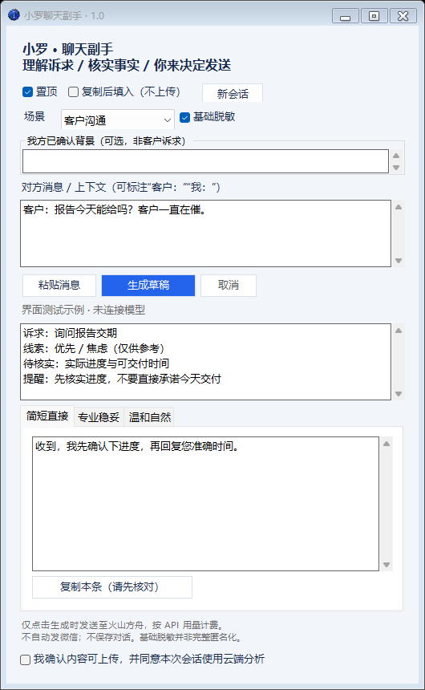

# 小罗聊天副手 2.0

一个跑在 Windows 上的本地小工具，用来在**各种聊天场景**里帮你快速理解对方的意思、并起草回复。

场景可以切换：客户、同事、老师、家人、朋友、群聊。每个场景有自己的一套判断维度、语气风格和约束规则。

它做三件事：

1. **读懂对方**：一句话概括对方的核心意思，并给出**情绪维度柱状图**（急切度 / 情绪温度 / 对抗性 / 紧迫感），每根柱子标出模型对这条判断的**把握度**
2. **提醒该核实什么**：把你不确定、需要先确认的信息单独列成清单
3. **给三版草稿**：按当前场景给出三种语气，草稿区放大加粗，你挑一版改完再发

它**不会**替你发消息，也不会替你拍板。

### 关于情绪图表怎么读

生成后，草稿上方会多出一块「判断依据」区，左右分栏：

- **左边**：对方意思 + 情绪概括（一句话），下面是「待核实」清单，一条一行
- **右边**：情绪柱状图，图内表头直接写着「柱长=强度　右侧%=把握度」
- **柱长 = 强度**：这一维度的估计值（0~100）
- **右侧百分比 = 把握度**：模型对这条判断有多有底气（0~100）
- 把握度低于 40% 时数字会变灰，提示这项属于"没把握的估算"
- 鼠标悬停在图上会显示判断依据原文

**把握度是模型自评，不是严格的统计概率。** 它只是让模型诚实说出"我对这条判断有几分把握"，方向比数值可靠。完全没有线索时，模型会把强度和把握度都给低分。



---

## 怎么用

双击 `聊天助手.bat` 就行，不用装任何东西（用的是 Windows 自带的 PowerShell）。

流程：

1. 顶部选**场景**（客户 / 同事 / 老师 / 家人 / 朋友 / 群聊）
2. 把对方发来的消息粘进下面的框
3. 勾选底部同意项，点「生成草稿」（或按 `Ctrl+Enter`）
4. 挑一版草稿，核对后点「复制本条」，去聊天窗口里粘贴

小技巧：

- 想省事可以勾「复制后填入（不上传）」：之后你在任何地方复制文字，它会自动填进输入框，但**仍需你手动点生成**才会联网。
- 同一个会话里重复生成相同内容会走本地缓存，不再重复请求。
- **换场景会自动清空草稿和缓存**——因为"对客户说的话"和"对家人说的话"不能混用。
- 换人、换话题时点「新会话」。
- `Esc` 可以取消正在进行的请求。

---

## 六个场景分别是什么风格

| 场景 | 三档语气 | 额外约束 |
| --- | --- | --- |
| 客户沟通 | 简短直接 / 专业稳妥 / 温和自然 | 不许编造库存、价格、进度、交期 |
| 同事协作 | 简短高效 / 协作推动 / 轻松随和 | 不替同事做决定，不承诺对方的排期 |
| 老师沟通 | 简洁得体 / 恭敬求教 / 诚恳说明 | 不编造已完成进度或延期理由 |
| 家人沟通 | 简短报备 / 体贴回应 / 家常随意 | 不编造行程和身体状态 |
| 朋友闲聊 | 干脆利落 / 接梗逗趣 / 走心回应 | 不假装答应做不到的事 |
| 群聊接话 | 简短表态 / 稳妥中立 / 和气圆场 | 不替别人表态，不转未确认信息 |

想加新场景，改 `assistant.ps1` 里的 `$Scenes` 表即可——界面、提示词、页签都会自动跟着变。

---

## 安全与隐私

默认设置偏保守，几点说清楚：

- **默认不联网**：不勾同意项就不会发送任何内容。
- **默认不监听剪贴板**：需要你手动打开，且只填入文字，不自动上传。
- **不做完整匿名化**：「基础脱敏」只处理手机号、邮箱、证件号、长号码这类明显格式，不能保证去标识化。真实敏感信息请自己先判断。
- **疑似凭据会拦截**：检测到密钥、密码、验证码等内容会阻止上传。
- **只连白名单地址**：仅向火山方舟 / OpenRouter / TypeSafe 官方 HTTPS 端点发送请求，不跟随重定向。
- **不落盘**：对话内容只存在内存里，关掉窗口就没了。
- **不自动发消息**：任何情况下都不会操作你的微信。
- **计费**：调用会按服务商的 API 用量计费；点取消不代表免除已经产生的费用。

代码里不含任何密钥。API 凭据放在本机的 `.env` 里，这个文件已被 `.gitignore` 排除。

---

## 配置

在程序同目录建一个 `.env`：

```
ARK_API_KEY=你的密钥
ARK_MODEL=你的模型名
```

密钥在[火山方舟控制台](https://console.volcengine.com/ark)创建，模型名填你已开通的模型 ID 或推理接入点。

也支持任意 OpenAI 兼容接口（OpenRouter 等），或 TypeSafe 的 Jev。详见 `.env.example`。

> 如果模型报 `ModelNotOpen`，说明密钥是对的，只是对应模型还没在控制台里开通。

### Jev 判断层（可选）

Jev 是 TypeSafe 的 System One 模型：它**只做判断，不生成文本**，一次调用 70~500ms 返回带概率的类型化结果（choice / score / noul）。

2.0 已经给 Jev 留好了插槽，架构上分成了两层：

```
Jev 判断层（可选）—— 先判断这是什么情况
     ↓
生成模型 —— 再起草该怎么说
```

**目前这个插槽是空的**，原因很直接：TypeSafe 官方在 2026-09-23 因需求超预期**暂停了 Jev 新用户注册**，暂时拿不到 key（已注册的老账号不受影响，恢复时间未公布）。

等拿到 key 后，在 `.env` 里填：

```
TYPESAFE_API_KEY=tsf_...
TYPESAFE_MODEL=jev-latest
```

程序会自动把判断和起草拆成两步走。**在此之前，填了 `ARK_API_KEY` 就能正常用**，走单步生成。

> 想先感受一下 Jev 输出什么样，可以到 [jevtypesafeai.com](https://jevtypesafeai.com/zh) 的 playground 免费试用，不用注册。
> 注意那个站是**独立的第三方**，不是 TypeSafe 官方——如果要在上面买托管 key，别绑重要的支付方式。

---

## 项目文件

| 文件 | 作用 |
| --- | --- |
| `assistant.ps1` | 聊天副手 2.0 主程序（PowerShell + WinForms，无第三方依赖；情绪图表用 GDI+ 手绘，建议回复区独占一栏加宽） |
| `聊天助手.bat` | 双击启动聊天副手 |
| `validate-assistant.ps1` | 验证入口，三种模式见下 |
| `archive/v1/` | 1.0 版本留档（单客户场景），需要时还能跑 |
| `archive/wechat-bot/` | 早期实验留档：微信机器人（`bot.py` + 启动器）。功能已被 2.0 的「判断+起草」覆盖，且需要 Python 依赖，故下线归档 |

### 验证

```
powershell -ExecutionPolicy Bypass -File validate-assistant.ps1              # 离线回归
powershell -ExecutionPolicy Bypass -File validate-assistant.ps1 -Mode Smoke  # 界面构建 + 截图
powershell -ExecutionPolicy Bypass -File validate-assistant.ps1 -Mode Test   # 真实调用一次
```

离线回归用 .NET 假 HTTP 处理器驱动**同一套界面状态机**，覆盖成功、取消、超时、各类 HTTP 错误、格式校验、缓存命中、场景隔离、敏感信息拦截，以及情绪维度解析（强度与把握度分离、越界分数拒绝、缺字段时降级不失败）。全程 0 次远程请求。当前 **86 项断言全部通过**。结果写在 `验证记录/` 下。

另有一个 `-Stress` 模式：在真实窗口里每 40ms 模拟乱点（轮切六个场景 / 点复制 / 开关监听），用来复现和拦截界面崩溃。修复历史 bug 后，连跑多轮 90+ 步均为 0 异常。

```
powershell -ExecutionPolicy Bypass -File validate-assistant.ps1 -Mode Stress  # 真实窗口压力测试
```

> 报告与截图路径统一按脚本目录解析：即使从别的目录调用，也不会把文件写到意外的位置。

---

## 设计取舍

- **不做「一键自动回复」**：发出去的话是要负责的。工具只给草稿，发送权始终在人手里。
- **场景即语境**：换场景必须清空旧草稿和缓存，避免"对客户说的话"被误用到家人对话里。
- **把握度标注为「模型自评」**：需求要求给把握度，但模型没有统计校准能力。折中做法是照实展示，同时在图表标题和文档里写明它只是自评、非严格概率，并让低把握度的项目在视觉上弱化（灰字），避免虚假精确感。
- **取消「我方已确认背景」输入框**：原来要用户手填己方事实，但填了等于在促成"替你承诺"。去掉之后规则更硬——模型只能靠对方原话判断，凡是需要己方事实的说法一律降级成条件性表达，并全部列进「待核实」。这样界面少一个框，风险也少一层。
- **提示词里明确禁止编造**：库存、价格、折扣、进度、交付日期这类信息一律不许写成既定事实。对方催得再急，也不能变成我方「已承诺」。
- **Jev 只判断不生成**：这是它和聊天模型的根本区别，所以职责拆开——Jev 说"这是什么情况"，生成模型说"这话该怎么说"。
- **参考了三个开源项目的交互思路**（[Pot](https://github.com/pot-app/pot-desktop)、[ChatGPTBox](https://github.com/ChatGPTBox-dev/chatGPTBox)、[Chatbox](https://github.com/chatboxai/chatbox)），仅借鉴产品设计，未复制代码。

---

## 已知限制

- 只支持 Windows（依赖 PowerShell 5.1 和 WinForms）。
- 单文件脚本，没做模块拆分。
- 「情绪」只是文本层面的线索判断，不是心理评估；把握度也是模型自评。
- 不给「我方背景」输入框，所以草稿不会引用你的价格、进度、交期等事实，需要时自己补一句。
- 模型偶尔不返回情绪字段时，图表区降级为提示文字，而不是画假柱子。
- 长对话建议只贴关键片段，输入上限 6000 字。
- Jev 判断层尚未启用（等官方恢复注册）。
